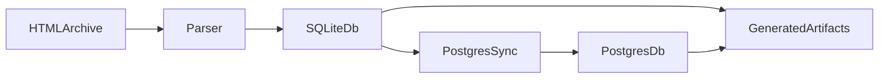

# FSV Data Pipeline

Installierbares Python-Paket, das das HTML-Archiv des FSV Mainz 05 in SQLite parst und das Ergebnis nach PostgreSQL synchronisiert.

Der Handover-Workflow ist bewusst schlank:

1. HTML nach SQLite parsen.
2. SQLite nach PostgreSQL synchronisieren.
3. Optional Profilindizes und Entity-Linking-Reports erzeugen.

Alles ausserhalb dieses Workflows wurde in das Schwesterarchiv `../archive/fsv_data_pipeline_legacy/` verschoben und gehoert nicht zur Day-One-Wartung.

## Unterstuetzter Workflow



Wichtige Einstiegspunkte:

- `fsv-pipeline-parse`
- `fsv-pipeline-sync`
- `fsv-pipeline-status`
- `fsv-pipeline-build-indices`
- `fsv-pipeline-entity-report`

## Einrichtung

```bash
cd fsv_data_pipeline
python -m venv .venv
source .venv/bin/activate
python -m pip install -e .
cp .env.example .env
```

Erforderliche Eingabe:

- eine Archivquelle, entweder:
- ein lokales Verzeichnis wie `fsvarchiv/`
- eine Website-URL mit derselben HTML-Struktur, die zuerst lokal gespiegelt wird
- wenn `--source` fehlt, verwendet der Parser `fsvarchiv/` oder `FSVARCHIV_PATH`

Erforderliche Umgebung:

- `DATABASE_URL` oder `DB_URL` fuer den PostgreSQL-Sync

## Wichtige Befehle

Archiv nach SQLite parsen:

```bash
fsv-pipeline-parse
```

Aus einem bestimmten lokalen Ordner parsen:

```bash
fsv-pipeline-parse --source /path/to/fsvarchiv
```

Von einer Website parsen, die zuerst in ein temporaeres lokales Spiegelverzeichnis geladen wird:

```bash
fsv-pipeline-parse --source https://example.com/fsvarchiv/
```

Eine oder mehrere Saisons parsen:

```bash
fsv-pipeline-parse --seasons 2023-24 2024-25
```

PostgreSQL-Sync als Vorschau ausfuehren:

```bash
fsv-pipeline-sync --dry-run
```

PostgreSQL-Sync ausfuehren:

```bash
fsv-pipeline-sync
```

PostgreSQL-Status gegen die lokale SQLite pruefen:

```bash
fsv-pipeline-status
```

Optionale Profilindizes erzeugen:

```bash
fsv-pipeline-build-indices
```

Entity-Linking-Report erzeugen:

```bash
fsv-pipeline-entity-report
```

## Aktive Struktur

| Pfad | Zweck |
|------|-------|
| `parsing/` | Aktiver HTML-nach-SQLite-Parser plus kleine optionale Reporting-Helfer |
| `database/` | Aktiver SQLite-nach-Postgres-Sync plus Schema-SQL und Migrationen |
| `docs/` | Verbindliche Handover- und Referenzdokumentation |
| `tests/` | Reproduzierbare Smoke- und Unit-Tests |

Generierte Ausgaben werden nicht mehr in Quellordnern abgelegt. Sie gehoeren nach `generated/`, das bewusst von Git ignoriert wird.

## Verifikation

Vor der Uebergabe sollten mindestens die automatisierten Checks laufen:

```bash
python -m unittest discover tests
```

## Wartungshinweise

- `docs/HANDOVER.md` fuer das Onboarding neuer Maintainer
- `docs/OPERATIONS.md` fuer wiederholbare Wartungsaufgaben
- `docs/DATABASE_SCHEMA.md` fuer belastbare Schema-Fakten
- `docs/FILE_INVENTORY.md` fuer die Keep-/Archive-Klassifikation
