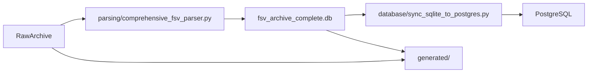

# Architektur

## Zweck

`fsv_data_pipeline` wandelt das rohe HTML-Archiv des FSV Mainz 05 in strukturierte Daten um, die vom Rest der Anwendung sicher abgefragt werden koennen.

## Kanonischer Datenfluss

## Aktive Komponenten

### `parsing/`

Aktiver Parser- und Reporting-Code.

- `comprehensive_fsv_parser.py`: massgeblicher HTML-nach-SQLite-Parser
- `profile_index_builder.py`: optionale Generierung von Profilindizes
- `entity_linking_report.py`: optionaler Report zur Linking-Qualitaet

### `database/`

Aktiver PostgreSQL-bezogener Code.

- `sync_sqlite_to_postgres.py`: kanonischer Einstieg fuer den Sync
- `001_create_schema.sql`, `002_materialized_views.sql` und `migrations/*.sql`: Schema-Referenz und Migrationen

### `docs/`

Kleine, verbindliche Dokumentationsmenge fuer Onboarding, Betrieb, Schema-Fakten und Inventar.

### `tests/`

Reproduzierbare Smoke- und Unit-Tests. Das Fixture-Archiv unter `tests/fixtures/` ist bewusst so klein gehalten, dass ein neuer Maintainer Parser-Checks auch ohne das komplette echte Archiv ausfuehren kann.

## Design-Regeln

- Bevorzuge `HTML -> SQLite -> PostgreSQL` statt direkter HTML-nach-Postgres-Ingestion.
- SQLite ist die fachliche Quelle der Parsing-Ergebnisse.
- Generierte Artefakte gehoeren nach `generated/`, nicht neben den Quellcode.
- Bevorzuge paketierte CLI-Befehle statt `PYTHONPATH`- oder `sys.path`-Workarounds.
- Halte die aktive Paketoberflaeche klein; Einmal-Wartung und historische Altpfade gehoeren nicht in den Standard-Workflow.
- Betriebsdoku soll den aktuellen Ist-Zustand beschreiben, nicht historische Zwischenstaende.
